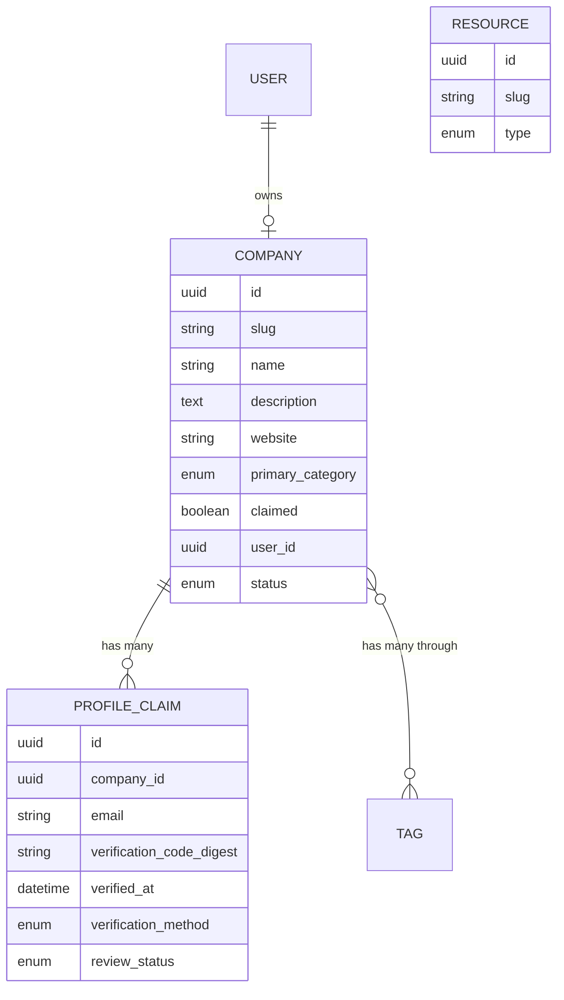

# baltimore.ai — Directory MVP (self-serve, SEO-first)

## Overview

Stand up baltimore.ai as a city-vertical directory of AI companies, AI-adjacent organizations, and AI practitioners in the Baltimore metro. MVP is **directory-only** (no newsletter, events, or jobs board yet). Success bar at 3 months is **SEO/traffic**: rank on page 1 for "AI companies in Baltimore" and a long-tail set of facet queries, with ≥1k organic monthly visits.

Stack: **Rails 8 + Hotwire + Postgres + Solid Queue, deployed to Fly.io.** Self-serve onboarding via the **profile claim/verify pattern lifted from RooferRate** (`/Users/justuseapen/Dropbox/code/tradecraft/rooferrate`) — this is a deliberate reuse decision, not a rebuild.

## Problem Statement / Motivation

The user owns `baltimore.ai` and wants to convert it from a parked domain into something that (a) means something to the local Baltimore tech scene, (b) compounds in SEO value over time, and (c) preserves resale optionality if they ever want to sell. A self-serve directory hits all three: every claimed listing adds a unique high-quality page, the cumulative pages create topical authority for Baltimore-AI queries, and a real audience makes the domain materially more valuable than a parked one.

There is currently no canonical "AI in Baltimore" directory. Built In has a generic Baltimore facet page that ranks well but isn't AI-specific or locally-curated; Crunchbase covers companies but not people, jobs, or community context. The wedge is **AI-specific + Baltimore-specific + self-serve quality**.

## Proposed Solution

A Rails app with three primary entity types and a curated facet structure:

- **Companies** — AI-native or AI-significant orgs based in or with significant presence in Baltimore (incl. Hopkins APL spinouts, UMBC labs, AI-using SMBs).
- **People** — founders, researchers, engineers, consultants. Optional, claim-based.
- **Resources** — labs, accelerators, programs (FastForward U, TEDCO, Hopkins APL, UMBC AI lab).

Each entity has an editorial summary + structured fields (links, location, tags, founding date, etc.). The directory is **owner-editable via claim/verify** so listings stay fresh without curator load.

URL architecture, schema markup, and internal linking are designed up-front for SEO compounding (see Technical Considerations).

## Scope (MVP) — In and Out

**In scope:**
- Companies entity with full claim/verify flow.
- Resources entity (admin-managed only at MVP — too few to need self-serve).
- Public directory pages: home, all companies, category facets, individual listings.
- "Top X" editorial pages (handcrafted) — ~5 at launch.
- Schema.org markup, sitemap, robots, breadcrumbs.
- Admin moderation queue.
- Seed data: ~30 companies, ~10 resources.

**Out of scope for MVP (parked for v2+):**
- People entity / individual contributor profiles.
- Newsletter, events, jobs board, blog.
- Comparison pages (`/compare/a-vs-b`).
- API / data export.
- User accounts beyond the claim flow (no homepage feed, no follows, etc.).
- Paid features / featured listings.

## Technical Considerations

### Stack & deployment
- Rails 8 (Solid Queue, Solid Cache, Solid Cable — no Redis needed for MVP).
- PostgreSQL on Fly.io.
- Hotwire (Turbo + Stimulus) — no SPA.
- Tailwind CSS + a small custom design system (avoid generic AI-aesthetic templates).
- Active Storage on Fly Volumes or Tigris (S3-compat) for logos.
- Deploy: `fly deploy`, secrets via `fly secrets set`, `/up` health endpoint.

### Data model (high level)

```
Company
  id, slug, name, tagline, description (markdown)
  website, linkedin_url, github_url, crunchbase_url
  city, state, country, lat, lng (default Baltimore, MD, US)
  founded_year, employee_count_bucket
  primary_category (enum: applied_ai, infra, research, consulting, etc.)
  tags [] (computer_vision, llm, robotics, healthcare_ai, ...)
  logo (Active Storage)
  status (draft | published | hidden)
  claimed boolean
  user_id (owner) nullable
  last_verified_at
  meta_description (override), meta_title (override)
  source (curator | self_submitted | imported)
  timestamps + updated_at-driven freshness signal

Resource
  similar shape, type enum: lab | accelerator | program | event_series

ProfileClaim  (lifted from RooferRate)
  company_id, email
  verification_code_digest, verification_code_sent_at, verification_sends_count
  verified_at, verification_method (domain_match | manual_review)
  review_status (auto_approved | pending_review | approved | rejected)
  reviewed_by, reviewed_at, claimant_name, claimant_role
  current_step, completed_at

User  (only created post-claim, like RooferRate)
  email, role (owner | admin)
  Tied to a single Company via Company#user_id
```

ERD:



### Claim/verify flow (reused from RooferRate)

The full investigation lives in this conversation's research output. Key reusable pieces from `/Users/justuseapen/Dropbox/code/tradecraft/rooferrate`:

- `app/models/profile_claim.rb` — verification code generation, BCrypt hashing, 15-min expiry, rate limiting (60s cooldown, max 3/hr), `domain_matches_website?` for auto-approval.
- `app/controllers/profile_claims_controller.rb` — send_code → confirm_code → wizard step routing, session-based state via `session[:profile_claim_id]`.
- `app/mailers/profile_claim_mailer.rb` — verification_code, admin_new_claim, welcome templates.
- `app/controllers/admin/profile_claims_controller.rb` — manual approval flow with claimant capture.

**Adapt for baltimore.ai:**
- Replace `RooferBusiness` references with `Company`.
- Wizard steps: `verify → basics (website, tagline, location) → story (description, founded_year, team_size) → links (linkedin, github, crunchbase) → tags (categories + topical tags)`. Skip the photos/services steps that are roofer-specific.
- Drop the enrichment wizard (pricing/preferences/growth) — irrelevant here.
- Drop the "first 50 per state get featured" promo — irrelevant.

**Fix the rough edges flagged in the research before shipping:**
- Add an explicit ownership check on edit: `current_user.company == @company` before any update.
- Auto-reject `pending_review` claims after 30 days (background job).
- Make verification expiry env-configurable (`CLAIM_CODE_TTL_MINUTES`, default 15).
- Harden URL parsing in `domain_matches_website?` against malformed schemes (force `https://` prefix if missing before URI.parse).

### URL architecture (SEO-driven)

Pattern, mirroring Built In's hierarchy that already ranks for the head term:

```
/                                       — city home (entity hub)
/companies                              — all companies (ItemList)
/companies/[slug]                       — individual company (flat slug, not nested under category)
/categories/[category-slug]             — facet hub (e.g. /categories/applied-ai)
/categories/[category-slug]/[tag-slug]  — facet × tag (only if ≥3 entities; else 404 or noindex)
/resources                              — all resources
/resources/[slug]
/guides/[slug]                          — handcrafted "top X" editorial
/claim/[slug]                           — claim flow (noindex)
/admin/*                                — admin (noindex, behind auth)
```

**Slug rules:** flat, kebab-case, no category prefix on company slugs (a company that spans multiple categories shouldn't churn its URL). One canonical URL per entity; no `?utm=` indexed variants.

**Empty-facet handling:** facet pages with <3 entities return a noindex meta tag and a "we don't have enough listings here yet" stub — never an empty list. This is non-negotiable to avoid the Aug/Dec 2025 thin-content classifier penalties.

### Schema.org markup

JSON-LD on every page, three layers:

- **Site-wide:** `Organization` for baltimore.ai itself + `WebSite` with SearchAction.
- **Company detail pages:** `Organization` (NOT `LocalBusiness` — Google's 2026 docs flag misuse of LocalBusiness for non-storefront orgs as an audit signal). Required props: `name`, `url`, `logo`, `address` (PostalAddress), `sameAs` (LinkedIn, Crunchbase, GitHub, X), `foundingDate`, `numberOfEmployees`, `description`. Use specific subtypes (`SoftwareApplication`, `ResearchOrganization`) where applicable.
- **Listing pages:** `ItemList` with `itemListElement` of `ListItem`s — produces the carousel rich result.
- **Every page:** `BreadcrumbList`.
- **Category hubs:** add `FAQPage` with 3-5 Qs (still feeds People-Also-Ask even though rich result eligibility narrowed in 2023).

### Content depth per page

Word count isn't a ranking factor; **topical coverage is**. Each company page targets 400-800 unique words: 1-paragraph editorial summary (curator-written or AI-drafted then human-edited — never raw scrape), founders + LinkedIns, funding rounds w/ dates, tech-stack tags, 3-5 news mentions w/ outbound links, address, "similar companies" sidebar (3-5 same-category links), `last_verified_at` timestamp visible on the page.

### Internal linking

- Every company detail page links to 3-5 siblings in the same primary category and 1-2 in adjacent categories ("similar companies").
- Category hubs link laterally to adjacent categories.
- Every detail page is ≤3 clicks from `/`.
- Anchor text uses descriptive phrases ("Baltimore computer-vision startups"), never "click here."
- Sitemap.xml generated nightly via `sitemap_generator` gem; ping Google + Bing on regen.

### Anti-spam / quality gates

- Email verification (RooferRate flow) — already required.
- Domain-match auto-approve only when claimant email domain matches company website domain. Everything else → admin queue.
- Manual admin approval for any company with no website, no LinkedIn, or registered <30 days.
- Rate-limit claim attempts per IP (3/hour, on top of the per-email limit RooferRate already enforces).
- `noindex` on a listing until it has at least: name + description (≥80 chars) + website + 1 link in `sameAs`. Below that bar, the page exists internally but is not exposed to Google.

## System-Wide Impact

- **Interaction graph:** `POST /claim/:slug/confirm` → `ProfileClaim#approve_or_queue_review!` → either marks `auto_approved` (writes `Company#claimed=true` only on `complete_claim!`) or enqueues `AdminMailer.new_claim`. Wizard steps each persist via `Company#update!` inside a transaction with the claim record. Sitemap regeneration job listens on `Company` `after_commit`.
- **Error propagation:** all wizard steps wrapped in transactions. Mailer failures are async (Solid Queue) and must not block claim progression — failed sends retry with exponential backoff and surface to admin after 3 failures. Verification code mismatches are user-facing errors, not exceptions.
- **State lifecycle risks:** RooferRate's `complete_claim!` creates User + sets `claimed=true` in one transaction — preserve this. A failure between "verified" and "wizard complete" leaves a `verified_at`-set claim with `current_step` mid-flow; the user resumes via session, no orphan state.
- **API surface parity:** no public API at MVP. All admin operations go through `/admin` controllers; do not expose JSON endpoints until v2.
- **Integration test scenarios:**
  1. Claimant with matching email domain completes wizard end-to-end → company published, user created, sitemap updated.
  2. Claimant with non-matching domain → ends at "pending review," admin approves → published.
  3. Two different emails attempt to claim the same company → second blocked by `claimed=true`.
  4. Same email re-attempts within rate-limit window → blocked with clear UX.
  5. Wizard abandoned mid-flow → user returns via emailed link → resumes at correct step.

## Acceptance Criteria

### Functional
- [x] User can browse all published companies at `/companies` with category filter.
- [x] Each company has its own page at `/companies/[slug]` with full schema.org `Organization` JSON-LD.
- [ ] User can initiate a claim at `/claim/[slug]`, receive a verification code, complete the wizard, and the company appears as `claimed` with their edits live.
- [ ] Domain-matching emails auto-approve; non-matching go to admin queue.
- [ ] Admin can approve/reject pending claims at `/admin/profile_claims`.
- [ ] Owner can edit their claimed company at `/companies/[slug]/edit` (gated by `current_user.company == @company`).
- [x] sitemap.xml lists all published companies, resources, categories, and guides.
- [x] robots.txt allows crawling of public pages, disallows `/admin`, `/claim`.
- [x] At least 30 seeded companies + 10 resources visible at launch.
- [x] 5 handcrafted `/guides/[slug]` "top X" editorial pages live at launch.

### Non-functional
- [ ] Lighthouse SEO score ≥95 on home, `/companies`, `/companies/[slug]`, a category hub.
- [ ] Lighthouse Performance ≥90 mobile on the same pages.
- [ ] Core Web Vitals pass (LCP <2.5s, INP <200ms, CLS <0.1) on company detail pages with logo + 5 sibling links.
- [ ] All public pages render meaningful HTML without JS (Hotwire enhances; doesn't gate).
- [ ] Schema.org validates in Google Rich Results Test for `Organization`, `ItemList`, `BreadcrumbList`, `FAQPage`.

### Quality gates
- [ ] Integration tests for all 5 scenarios listed above.
- [ ] System test for the full claim wizard.
- [ ] `bin/rubocop` + `bin/brakeman` clean.
- [ ] Manual SEO checklist run pre-launch (see "SEO launch checklist" appendix below).

## Success Metrics (3 months post-launch)

- **Traffic:** ≥1,000 monthly organic visits per Google Search Console.
- **Rankings:** page-1 SERP for at least 3 of: "AI companies in Baltimore," "Baltimore AI startups," "AI consultants Baltimore," "Baltimore machine learning companies," "Baltimore AI labs."
- **Coverage:** ≥75 published companies (30 seeded + 45 self-claimed or curator-added).
- **Claim rate:** ≥40% of seeded listings claimed by their owner within 90 days (signal that the directory is meaningful to insiders).
- **Citation count:** baltimore.ai listed on ≥5 local citations (Technical.ly, BBJ Online, EAGB, Greater Baltimore Committee, FastForward U).

## Dependencies & Risks

**External:**
- Fly.io account + Postgres (already user's default).
- Email provider (Postmark or Resend) for transactional mail.
- Tigris or S3 bucket for logo storage.
- Google Search Console + Bing Webmaster verification.

**Risks:**
- **Cold start:** an empty directory ranks for nothing. Mitigation: 30 seeded listings on day one + 5 editorial "top X" guides.
- **Spam claims:** addressed by rate limits + domain-match gating + admin queue.
- **Thin facet pages tanking site-wide rankings:** addressed by noindex-on-thin rule (≥3 entities required).
- **Maintenance creep:** if user can't sustain weekly curator effort, claim flow needs to be easy enough that growth is self-serve. Hence prioritizing the claim UX from day one.
- **Domain misuse risk:** if listings get hijacked, brand damage on a 10-year-held domain is real. Hence ownership check + admin oversight + audit trail.

## Implementation Phases (rough sequencing)

### Phase 1 — Foundation (week 1) ✅ DONE 2026-05-06
- [x] `rails new baltimore_ai --css tailwind --database=postgresql`
- [x] Fly.io setup (fly.toml + DEPLOY.md), secrets documented, `/up` health check wired
- [x] Schema: Company, Resource, Tag, CompanyTag, ProfileClaim, User. Migrations + indexes.
- [ ] Basic admin (deferred to Phase 3 alongside claim moderation)
- [x] Seed script with 30 real Baltimore AI companies + 10 resources + 18 tags

### Phase 2 — Public directory (week 2) ✅ DONE 2026-05-06
- [x] Routes, controllers, views for `/`, `/companies`, `/companies/[slug]`, `/categories/[slug]`, `/resources`, `/resources/[slug]`
- [x] JSON-LD partials (`Organization`, `ItemList`, `BreadcrumbList`, site-wide `Organization`+`WebSite` graph)
- [x] Sitemap (sitemap_generator) + robots.txt with sitemap pointer
- [x] Tailwind design pass — newspaper-style, red accent, distinctive
- [ ] Mobile/Core Web Vitals verification on real device (still TODO)

### Phase 3 — Claim flow (week 3)
- Port ProfileClaim model + controller from RooferRate, adapted to Company.
- Mailer setup (Postmark/Resend).
- Wizard views (verify → basics → story → links → tags).
- Admin moderation queue.
- Apply the rough-edge fixes (ownership check, 30-day pending auto-reject, configurable TTL, URL hardening).
- Integration tests for the 5 scenarios.

### Phase 4 — SEO finishing + launch (week 4)
- 5 handcrafted `/guides/*` pages.
- Search Console + Bing Webmaster verification, sitemap submission.
- Submit baltimore.ai to Technical.ly, BBJ, EAGB, Greater Baltimore Committee, FastForward U.
- Outreach to first ~10 seeded companies asking them to claim their listing.
- Public launch: ProductHunt, Twitter, Hacker News (Show HN), local Slack/Discord communities.

## Alternative Approaches Considered

- **Static site (Astro / Eleventy + Buttondown):** Faster to ship and cheaper to host, but the self-serve claim flow is fundamentally a stateful interactive feature. Bolting auth + email verification onto a static site is more work than just using Rails. Rejected.
- **Next.js + Vercel:** Equivalent capability, no compelling reason to switch given user's existing Rails fluency and Fly.io default. Rejected.
- **Curator-only model (no claims):** Simpler, but caps growth at user's available time. The whole point of self-serve is that the directory should grow without curator intervention. Rejected.
- **People entity in MVP:** Worth doing eventually, but doubles the surface area and people-pages tend to be thinner than company-pages, which would dilute SEO. Defer to v2.

## SEO Launch Checklist (appendix)

- [ ] All public pages return 200 with full HTML (no JS-only render).
- [ ] Canonical tags on every page.
- [ ] `Organization` JSON-LD validates per company.
- [ ] `ItemList` JSON-LD validates on `/companies` and category hubs.
- [ ] `BreadcrumbList` on every page below root.
- [ ] sitemap.xml at `/sitemap.xml`, listed in robots.txt, submitted to GSC + Bing.
- [ ] robots.txt disallows `/admin`, `/claim`, `/up`.
- [ ] meta description unique per page (auto-generated from description if not set).
- [ ] Open Graph + Twitter Card tags with logo.
- [ ] No empty facet pages indexed (noindex if <3 entities).
- [ ] Lighthouse SEO ≥95 on 4 sample pages.
- [ ] Rich Results Test passes for `Organization`, `ItemList`, `BreadcrumbList`.
- [ ] Google Business Profile claimed for "baltimore.ai" entity.
- [ ] First 5 local citations live (Technical.ly, BBJ, EAGB, GBC, FastForward U).

## Sources & References

### Internal references (reused patterns)
- ProfileClaim model & verification logic: `/Users/justuseapen/Dropbox/code/tradecraft/rooferrate/app/models/profile_claim.rb`
- Claim controller flow: `/Users/justuseapen/Dropbox/code/tradecraft/rooferrate/app/controllers/profile_claims_controller.rb`
- Admin moderation: `/Users/justuseapen/Dropbox/code/tradecraft/rooferrate/app/controllers/admin/profile_claims_controller.rb`
- Mailer templates: `/Users/justuseapen/Dropbox/code/tradecraft/rooferrate/app/mailers/profile_claim_mailer.rb`

### External references
- [Built In Baltimore AI facet page (live ranking example)](https://builtin.com/companies/location/baltimore/type/artificial-intelligence-companies)
- [Google: Organization structured data](https://developers.google.com/search/docs/appearance/structured-data/organization)
- [Google: LocalBusiness structured data (re: when NOT to use it)](https://developers.google.com/search/docs/appearance/structured-data/local-business)
- [Backlinko: Programmatic SEO 2026](https://backlinko.com/programmatic-seo)
- [SEOmatic: Programmatic SEO mistakes](https://seomatic.ai/blog/programmatic-seo-mistakes)
- [Rankability: Word count is not a ranking factor](https://www.rankability.com/ranking-factors/google/word-count/)
- [Mavik Labs: Internal linking strategy 2026](https://www.maviklabs.com/blog/internal-linking-strategy-2026)
- [Backlinko: Local SEO guide 2026](https://backlinko.com/local-seo-guide)
- [LinkinTech: Local SEO citations (Whitespark 2026 data)](https://linkintechseo.com/local-seo-citations-the-complete-guide/)
- [Schema App: LocalBusiness markup guide](https://www.schemaapp.com/schema-markup/how-to-do-schema-markup-for-local-business/)

### Local citations to pursue at launch
- [Technical.ly Baltimore](https://technical.ly/baltimore/)
- [Baltimore Business Journal Online](https://www.bizjournals.com/baltimore/)
- [Economic Alliance of Greater Baltimore (EAGB)](https://greaterbaltimore.org/)
- [Greater Baltimore Committee](https://gbc.org/)
- [Johns Hopkins FastForward U](https://ventures.jhu.edu/fastforward/)
