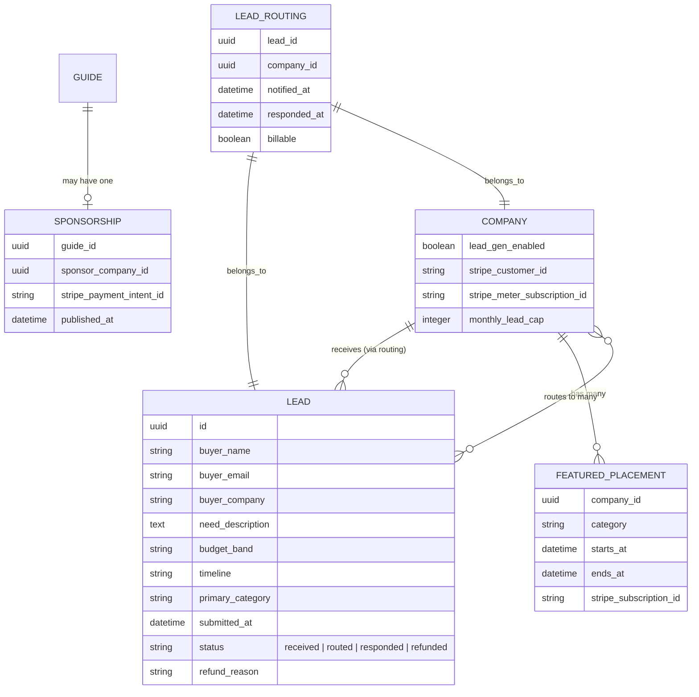

# Revenue model on the existing baltimore.ai directory

## Overview

Layer three revenue streams onto the existing baltimore.ai directory — no new product surface, no marketplace, no weekly content commitment.

The streams are sequenced by traffic and credibility prerequisites:

- **Stream C (Lead-gen brokerage)** — foundation, paid leads from inquiry forms to claimed vendors. Ships first.
- **Stream A (Featured listings)** — paid placement at top of /companies and category hubs. Ships at month 3+ once traffic is real.
- **Stream B (Sponsored guides)** — paid editorial pieces with explicit labeling. Ships at month 6+ once authority is real.

All three streams depend on **foundational pages first** (About, Editorial Standards, How It Works, Contact, Privacy, Terms, OG cards). Without those, no buyer trusts the directory, no vendor pays, and no sponsor signs a contract. Foundational pages are Phase 1 and the gate on everything else.

## Problem Statement / Motivation

baltimore.ai is live at https://baltimore.ai/ with 24 published company listings, 5 editorial guides, and 10 resources. The current state is **shipped but not monetized** — and shipped but lacking the foundational pages buyers/sponsors expect from a credible directory (the About page alone is the single highest-leverage E-E-A-T move per `SEO_TRUST_AND_POLISH.md:17-28`).

The user wants revenue from baltimore.ai. The 90-minute strategy session that produced this plan's origin brainstorm verified that the obvious wedges (talent marketplace, jobs board + digest) have too-thin volume and too-high content commitment to justify (see brainstorm: `docs/brainstorms/2026-05-11-revenue-model-brainstorm.md:24-42`). The directory itself is the asset; monetizing it directly with three layered streams is the realistic move.

**External research caveat carried forward:** lead-gen pricing in the brainstorm ($200-500/lead) is optimistic at 24 listings + ~1k MAU. Expect **$50-150/lead actual willingness** until conversion data exists (see Sources). The combined 12-month revenue ceiling stays in the brainstorm's $3-10k/mo range but is back-loaded — most revenue from Streams A and B at months 6-12, not from Stream C in months 1-3.

## Proposed Solution

A three-phase build, each phase delivering an independently shippable revenue capability and gating on the previous phase's prerequisites.

**Phase 1 (weeks 1-3): Foundational pages.** About, Editorial Standards, How It Works, Contact, Privacy, Terms. OG card generator. The single contact form built in Phase 1 doubles as Stream C's MVP — it's an inquiry endpoint that emails an admin, no Stripe yet.

**Phase 2 (weeks 4-7): Stream C — Lead-gen brokerage.** Lead model, lead-routing logic (weighted shortlist, not strict round-robin — see "Refinements from research" below), vendor opt-in via claim flow extension, founder-vendor program (3 free leads), then Stripe Billing Meters for usage-based billing once a vendor converts.

**Phase 3 (deferred, month 3+): Stream A — Featured listings.** Featured boolean (or `featured_until`) on Company, $99-249/mo per slot, capped at 3 per category to preserve editorial credibility. Stripe Subscription per featured slot.

**Phase 4 (deferred, month 6+): Stream B — Sponsored guides.** Sponsored flag on Guide model, explicit "Sponsored by" disclosure, Editorial Standards page governs what's acceptable. One-time Stripe payment per piece.

## Refinements from research (changes from the brainstorm)

The brainstorm captured a strategy; this plan refines it with three honest corrections from the research:

1. **Routing model.** Brainstorm said "round-robin among paying vendors." External research showed this breaks (vendors cherry-pick, capacity differs, buyers expect choice — Clutch uses weighted shortlists of 2-5 vendors). **Plan adopts weighted shortlist:** lead routes to up to 3 vendors in the matched category, scored by active subscription + response-rate + recency-of-rotation. All 3 are notified simultaneously; buyer can pick or vendors race to first-response.

2. **Pricing realism.** Brainstorm said "$200-500/lead." Research said expect **$50-150/lead until volume proves conversion**. Plan adopts a tiered structure: founding-vendor lock at $99/lead for 12 months, list price $199/lead, with annual review. Featured listings tier at $99-249/mo (research's $100-250 range), capped at 3 per category.

3. **Cold-start sequencing.** Brainstorm sequenced C immediately. Research says **subsidize first — give 3 free leads to founding vendors, get one testimonial conversion, then charge.** Plan adopts a "founder vendor program" sub-phase before any vendor pays.

These changes don't reverse the brainstorm; they implement it with eyes open.

## Technical Considerations

### Stack — additions to the existing baltimore.ai

- **Stripe Billing** (no gem; use `stripe` gem). Usage-based for Stream C via [Billing Meters](https://docs.stripe.com/billing/subscriptions/usage-based/advanced/about); flat subscriptions for Stream A; one-time charges for Stream B.
- **Cloudflare Turnstile** for inquiry-form spam control. Invisible, free up to 1M req/mo, no Google data sharing (research recommendation; superior to reCAPTCHA v3 for B2B).
- **Email deliverability check** at lead submit. Use `truemail-rails` gem or inline MX check; rejects obviously invalid emails before they reach the queue.

### Data model — net-new

Three new models, two new flags on existing models. ERD:

Two flags added to existing models:
- `companies.lead_gen_enabled` (boolean, default false) — opt-in for receiving leads.
- `guides.sponsored_by_company_id` (nullable FK) + `guides.sponsored_disclosure` (text) — both null for editorial guides.

### Reuse from existing patterns

Repo research (`a4c135393248d095f`) confirmed the existing patterns we mirror:

- **Admin controllers** mirror `Admin::ProfileClaimsController` (`app/controllers/admin/profile_claims_controller.rb`) — new ones: `Admin::LeadsController`, `Admin::FeaturedPlacementsController`, `Admin::SponsorshipsController`. All inherit from `Admin::BaseController` (`app/controllers/admin/base_controller.rb`).
- **Mailer pattern** mirrors `ProfileClaimMailer` (`app/mailers/profile_claim_mailer.rb`) — new ones: `LeadMailer` (`#notify_vendor`, `#confirmation_to_buyer`, `#refund_notice`), `BillingMailer`.
- **Integration tests** mirror `test/integration/claim_flow_test.rb` — same `assert_emails` pattern, same `:inline` queue adapter, same `extract_*_from_last_email` helper style.
- **Routes** extend the existing `config/routes.rb` — `resource :lead_inquiry, only: [:create]` nested under `companies`; top-level `/inquiries/new?category=...` for category-mode buyers; admin namespace gets `resources :leads, :featured_placements, :sponsorships`.
- **Claim flow extension** — `ProfileClaim#complete!` (in `app/controllers/profile_claims_controller.rb:148-161`) adds a "Enable lead-gen?" checkbox at the final step; default off (opt-in, not opt-out, per privacy + revenue ethics).

### Performance & scale

Negligible at this volume. The lead table will grow ~30-50 rows/quarter; Stripe API calls per lead are 1-2; mail volume per lead is 2-4. All async via Solid Queue (already in production, `app/jobs/auto_reject_stale_pending_claims_job.rb` is the template).

### Security & privacy

This is the high-risk surface and warrants attention:

- **Lead PII storage.** Buyer email + company + need-description is GDPR-relevant. Privacy page must disclose data collection, retention, and routing-to-vendors. Add a `consent_at` timestamp on every Lead record. Don't pre-check the consent checkbox.
- **California residents** — CCPA applies (the only US state with B2B-specific privacy law as of 2026). Lead form must include a "Do not sell my data" path; in practice this means giving buyers a way to request deletion. Build a basic `/privacy/delete-my-data` endpoint that fires `LeadDeletionJob`.
- **Stripe webhook validation.** Every webhook handler verifies signature against `STRIPE_WEBHOOK_SECRET`. Don't trust webhook bodies otherwise.
- **No payment card data touches our servers.** Stripe Checkout / Stripe Elements only.
- **FTC native ad disclosure.** Featured listings get a visible "Featured" or "Sponsored" badge above the listing card. Sponsored guides get "Sponsored by [Company]" at the top of the article AND in the meta description. Max FTC civil penalty per violation is ~$53k in 2026; this is cheap insurance.
- **Maryland wiretap law** explicitly **does not apply** to web forms (it's about audio recording per Md. Code §10-402). Documented here for the inevitable future paranoid moment.

### Anti-spam on inquiry form

Layered (research recommendation):
1. Cloudflare Turnstile (invisible).
2. Email MX check via inline gem.
3. Honeypot field (`<input type="text" name="company_url" tabindex="-1" autocomplete="off" style="position:absolute;left:-9999px">`).
4. Minimum 80-character "what do you need" field.
5. Rate-limit by IP (5 inquiries / hour).
6. Manual review of every lead for the first 90 days (doubles as quality QA).

## System-Wide Impact

### Interaction graph (for Stream C lead submission)

`POST /companies/:slug/lead_inquiry` →
  `LeadsController#create` →
    `Turnstile#verify` (fails fast on bot) →
    `Lead.create!(...)` →
      `after_commit → LeadRoutingJob.perform_later(lead.id)` →
        `LeadRoutingService.call(lead)` →
          selects up to 3 vendors via weighted shortlist →
          creates `LeadRouting` rows per vendor →
          `LeadMailer.notify_vendor(routing).deliver_later × N` →
          `LeadMailer.confirmation_to_buyer(lead).deliver_later` →
          `Stripe::Billing::MeterEvent.create` per routing (only if vendor has active billing) →
          admin notified via `LeadMailer.admin_new_lead` (manual review queue for first 90d)

### Error & failure propagation

- **Turnstile verification fails** → user-facing error, no lead created, no charge.
- **Stripe meter event fails** → log to Sentry/honeybadger (TBD), lead stays in DB with `billable: false`, can be retried via admin action. **Don't fail the user-facing flow on Stripe errors** — the lead is the artifact; billing is derivative.
- **Email delivery to vendor fails** → Solid Queue retries (default 5 attempts with exponential backoff). After 5 failures, admin gets the `LeadMailer#delivery_failure` alert.
- **Refund request** → admin manually flips `lead.status = "refunded"` + `lead_routing.billable = false`; if Stripe meter event already submitted, fire a `Stripe::CreditNoteService.create` to issue credit on next invoice.

### State lifecycle risks

- **Lead created but no routing happens** (job fails) → buyer's confirmation email never sent, vendor never notified. Solid Queue retries handle this. After max retries, admin alert + manual replay button on `/admin/leads/:id`.
- **Vendor disabled lead-gen between submission and routing** → routing service excludes them at job-run time. Lead may end up routed to <3 vendors; that's fine. If 0 vendors, fall back to admin-only notification.
- **Stripe customer doesn't exist for vendor** → routing succeeds, billing is no-op, vendor is in "free tier" implicitly. Admin sees this in the leads list with a "no billing configured" badge.

### API surface parity

There is no public API at MVP. All inquiry submission goes through the form. The admin interface duplicates form submission as `Admin::LeadsController#create` for manually-entered leads (e.g. phone inquiries the curator received).

### Integration test scenarios

1. **Happy path C:** Buyer submits inquiry on a category page → shortlist of 3 vendors notified → buyer confirmation email sent → meter event fired for one vendor that's billing-enabled, no-op for the other two.
2. **Bot blocked:** Turnstile fails → no lead created, no emails sent.
3. **Refund flow:** Admin marks lead as refunded → `Stripe::CreditNote` created → vendor receives `LeadMailer#refund_notice`.
4. **Featured cap:** 4th featured slot attempted in a 3-vendor-cap category → admin sees blocking error, must remove existing slot first.
5. **Sponsored guide labeling:** Guide marked sponsored renders with "Sponsored by" disclosure in both `<title>` (`meta description` retains brand) and visible heading; `meta name="robots"` unchanged (sponsored guides are indexable; FTC requires disclosure, not noindex).

## Acceptance Criteria

### Phase 1 — Foundational pages (gate on everything else)

- [x] `/about` page exists, names a real curator (Justus Eapen), describes how listings are curated.
- [x] `/editorial-standards` exists; explicitly covers what gets listed, what's sponsored, what's featured.
- [x] `/how-it-works` exists; describes claim flow + moderation + lead-gen flow (forward-looking).
- [x] `/contact` exists with a working form that emails `ADMIN_EMAIL`.
- [x] `/privacy` exists with GDPR/CCPA-relevant disclosures.
- [x] `/terms` exists with basic ToU for the directory.
- [x] All 6 pages linked from footer (4-column footer with Directory / About / For companies / Legal); included in sitemap at appropriate priority.
- [x] OG image: every public page emits a static 1200×630 PNG (`app/assets/images/og-default.png`). Per-page generator deferred to Phase 1.5 per user decision.
- [x] About page passes the headers-as-story test (per `SEO_HEADER_RULES.md`).

### Phase 2 — Stream C MVP

- [ ] `Lead` and `LeadRouting` models; migrations + indexes.
- [ ] `companies.lead_gen_enabled` flag added; default false.
- [ ] Claim wizard "tags" step gets an additional checkbox: "Enable lead-gen for this listing? You'll receive matched inquiries; we'll bill $X/lead." (Wording final after Editorial Standards is drafted.)
- [ ] `POST /companies/:slug/lead_inquiry` — per-company form path.
- [ ] `POST /inquiries` with `?category=...` — category-hub form path.
- [ ] Cloudflare Turnstile on both forms.
- [ ] Email MX validation server-side.
- [ ] `LeadRoutingService` implements weighted shortlist (≤3 vendors, scored by `active_subscription * 1.0 + response_rate * 0.5 + recency_of_rotation * 0.3`).
- [ ] `LeadMailer` with `notify_vendor`, `confirmation_to_buyer`, `admin_new_lead`, `refund_notice`.
- [ ] Admin queue at `/admin/leads`: index, show, mark-refunded, manually re-route.
- [ ] Founding-vendor program: 5 hand-picked vendors get 3 free leads each, locked $99/lead for 12 months after that.
- [ ] Stripe Billing Meters integration (only kicks in for billing-enabled vendors).
- [ ] Stripe webhook handler with signature verification.
- [ ] 5+ integration tests covering the scenarios above; existing CI green.

### Non-functional

- [ ] No PII leaked in logs (Rails 8 filters by default; verify `Lead#filter_parameters`).
- [ ] All Stripe IDs stored, never card data.
- [ ] FTC disclosure on every paid placement.
- [ ] Privacy page covers data retention (12 months default, deletion on request).
- [ ] Lighthouse SEO ≥95 on each foundational page.
- [ ] Lead-submission round-trip <2s p95 (Turnstile + MX check are the slow parts).

### Quality gates

- [ ] All new code passes existing CI (rubocop + brakeman + bundler-audit + tests).
- [ ] No new test fixtures (use the existing `Company.create!` pattern).
- [ ] Brakeman clean on Stripe integration code.
- [ ] Manual security review of webhook handler before first deploy.

## Success Metrics

**At month 1 post-deploy of Phase 1:**
- All 6 foundational pages live.
- 100% of public pages emit a real OG image.
- About page indexed in GSC.

**At month 3 post-deploy of Phase 2:**
- 5 founding vendors enabled lead-gen.
- 10+ leads submitted in the prior 30 days.
- 1 vendor has converted at least 1 lead and provided a testimonial.
- 0 reported PII or FTC issues.

**At month 6:**
- 1+ vendor paying for Stream C at full price.
- Stream A (featured listings) live with 2+ paying companies.
- $500+ MRR.

**At month 12:**
- $1k+ MRR combined across streams.
- 1+ sponsored guide published.
- 5+ inbound citations.

If month-12 numbers come in below $300 MRR, **revisit** — likely Streams A and B should defer further, or the wedge thesis itself was wrong.

## Dependencies & Risks

### Hard dependencies (must be done before Phase 2)
- Foundational pages (Phase 1).
- Stripe account created (user action, ~30 min).
- Cloudflare Turnstile account (user action, ~10 min).
- Postmark sender domain verified (was on LAUNCH.md TODO; required for any vendor/buyer email).

### Soft dependencies (helpful, not blocking)
- Real traffic. Phase 2 ships fine without traffic; just no leads will arrive. The founding-vendor program is the workaround.
- 5+ inbound citations. Same — useful for credibility but not blocking.

### Top risks

1. **Zero traffic kills Stream C in cold start.** Mitigated by founding-vendor program (curator-sourced leads count for the first quarter; vendor sees the platform works even if organic is thin).
2. **Editorial credibility erosion.** Featured/sponsored labels must be visible and unambiguous; cap on featured slots; sponsored guides require explicit Editorial Standards page (Phase 1 dependency). If a vendor pays then disappears mid-month with refund disputes, brand damage is hard to undo.
3. **PII exposure.** A lead leak (buyer info forwarded to wrong vendor, or admin DB exposure) is reputationally catastrophic on a small directory. Mitigated by: encrypted DB at rest (Fly managed Postgres handles this), Brakeman on every PR, no PII in logs, retention policy.
4. **Stripe integration time sink.** Billing Meters is newer (March 2025) and not as well-documented as legacy usage-based billing. Allocate a full sub-phase to Stripe integration with explicit fallback to manual invoicing if the meter approach proves brittle.
5. **The brainstorm's revenue ceiling was probably 2-3x optimistic.** External research suggests $50-150/lead at our volume, not $200-500. Plan accepts the lower number; if real prices come in higher, that's upside.

## Phase breakdown (executive summary, details above)

### Phase 1 — Foundational pages (weeks 1-3)
- Author 6 markdown-backed static pages.
- Generic `StaticController` + view templates.
- OG card generator service (background job, Active Storage).
- All pages linked from layout, included in sitemap as appropriate.

### Phase 2 — Stream C MVP (weeks 4-7)
- Schema: Lead, LeadRouting, Company#lead_gen_enabled.
- LeadsController (public + admin), LeadRoutingService, LeadMailer.
- Turnstile + MX + honeypot + rate-limit.
- Stripe Billing Meters + webhook handler.
- Claim wizard "enable lead-gen" step.
- Founding-vendor onboarding flow (admin).
- Integration tests.

### Phase 3 — Stream A (deferred to month 3+)
- Featured boolean / placement model.
- Public surfaces: featured slot on /companies and /categories/*.
- Stripe Subscription per slot.
- Cap of 3 per category enforced in admin.
- Explicit "Featured" label per FTC.

### Phase 4 — Stream B (deferred to month 6+)
- Sponsorship model on Guide.
- "Sponsored by [Company]" rendered at top of article + in title.
- Stripe one-time charge per piece.
- Editorial review process: Sponsored guides written by us, not vendor — vendor gets approval but not authorship.

## Sources & References

### Origin

- **Brainstorm:** [docs/brainstorms/2026-05-11-revenue-model-brainstorm.md](../brainstorms/2026-05-11-revenue-model-brainstorm.md). Key decisions carried forward: (1) three-stream model on existing directory, no new wedge; (2) foundational pages first; (3) explicit Featured/Sponsored labels.

### Internal references (verified via repo research)

- Existing claim-flow patterns: `app/controllers/profile_claims_controller.rb:148-161` (finalize_claim! — where consent crystallizes; will extend to capture lead-gen opt-in).
- Admin pattern to mirror: `app/controllers/admin/profile_claims_controller.rb` (entire file).
- Mailer pattern to mirror: `app/mailers/profile_claim_mailer.rb`.
- Test pattern to mirror: `test/integration/claim_flow_test.rb` (specifically the `:inline` adapter at `config/environments/test.rb:40` + `assert_emails` blocks).
- Company model and CATEGORIES: `app/models/company.rb:2-13`.
- Routes shape: `config/routes.rb` (claim flow at lines 17-24; admin namespace at lines 27-35).
- SEO disclosure rule pointer (only mention of "sponsored" in current SEO docs): `docs/SEO_ANCHOR_TEXT_RULES.md:86-90`.
- Static pages confirmed NOT built: only `StaticController#robots` exists (`app/controllers/static_controller.rb`).
- Stripe / payments: zero existing integration. Greenfield.

### External references (verified via best-practices research)

- [Stripe Advanced Usage-Based Billing (Meters)](https://docs.stripe.com/billing/subscriptions/usage-based/advanced/about) — primary integration target for Stream C.
- [Clutch Pay-Per-Lead docs](https://help.clutch.co/en/knowledge/pay-per-lead-program) — proven shortlist routing model.
- [Clutch Lead Matching update (2023)](https://help.clutch.co/knowledge/how-bid-on-lead-lead-matching) — why round-robin fails at scale.
- [FTC Native Advertising Guide](https://www.ftc.gov/business-guidance/resources/native-advertising-guide-businesses) — disclosure requirements for Featured/Sponsored.
- [FTC Endorsement Guides Q&A](https://www.ftc.gov/business-guidance/resources/ftcs-endorsement-guides-what-people-are-asking) — sponsored-content rules.
- [Cloudflare Turnstile vs reCAPTCHA](https://blog.rcaptcha.app/articles/cloudflare-turnstile-vs-recaptcha) — anti-spam choice rationale.
- [B2B Lead Conversion Benchmarks 2026](https://prospeo.io/s/b2b-lead-conversion-rates) — funnel math reality check.
- [Reforge: Marketplace Cold Start](https://www.reforge.com/guides/beat-the-cold-start-problem-in-a-marketplace) — founding-vendor program rationale.
- [Stripe Two-Sided Marketplace Strategy](https://stripe.com/resources/more/two-sided-marketplace-strategy) — pricing patterns.
- [Privado: CCPA 2026 Compliance Playbook](https://www.privado.ai/post/ccpa-compliance-playbook-for-2026) — PII handling for B2B forms.
- [Turnkey Directories: Featured Listing Pricing](https://turnkeydirectories.com/how-much-to-charge-for-featured-business-directory-listings/) — $100-250/mo range source.
- [Maryland Wiretap Statute §10-402](https://mgaleg.maryland.gov/mgawebsite/Laws/StatuteText?article=gcj&section=10-402) — does NOT apply to web forms (audio recording only).

### Related work in this repo

- LAUNCH.md (already deferred Featured/paid listings to post-launch).
- The 6 SEO docs (`docs/SEO_*.md`) — this plan's Phase 1 + Phase 3 must comply with anchor/header/meta rules.
- Phase 4 MVP plan: `docs/plans/2026-05-05-feat-baltimore-ai-directory-mvp-plan.md`.
